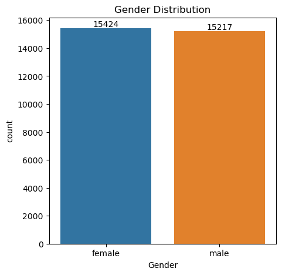
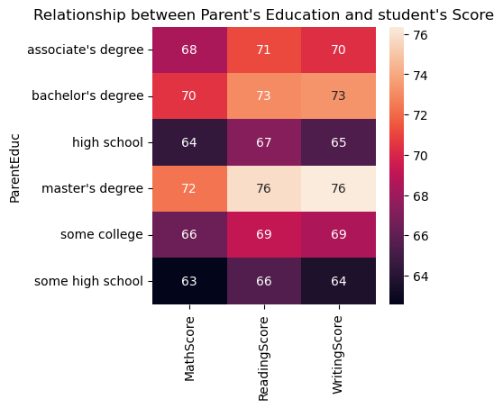
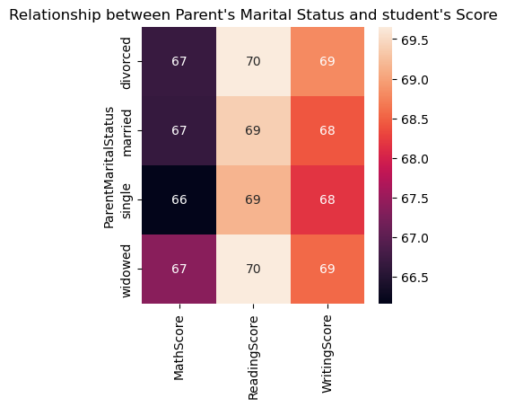
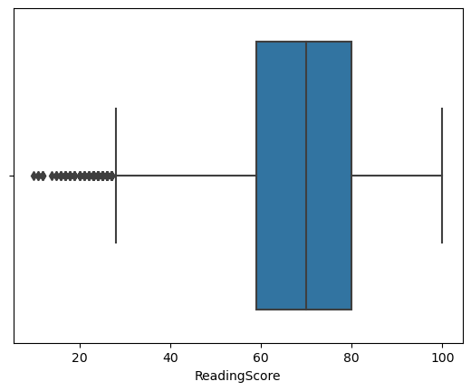
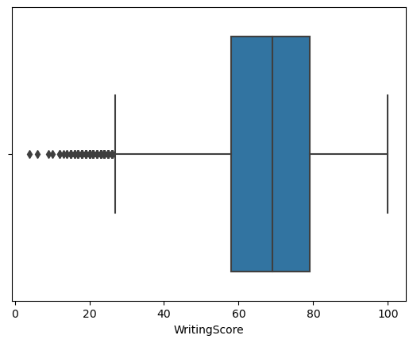
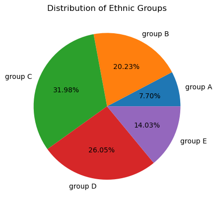
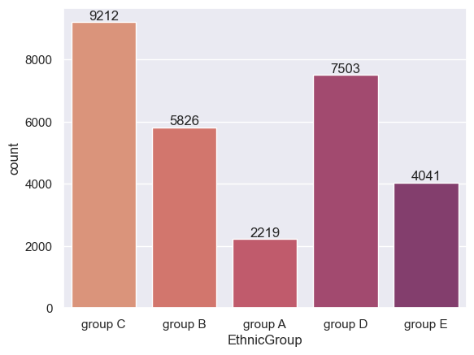
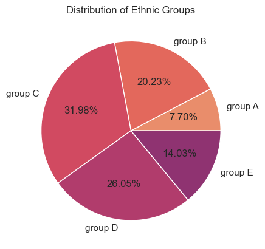
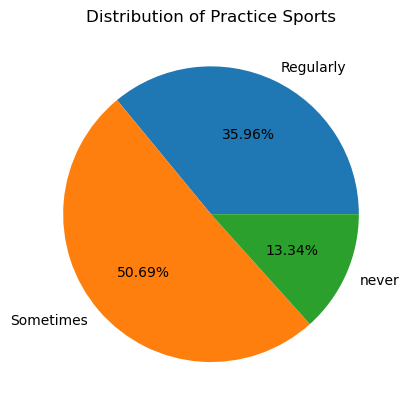
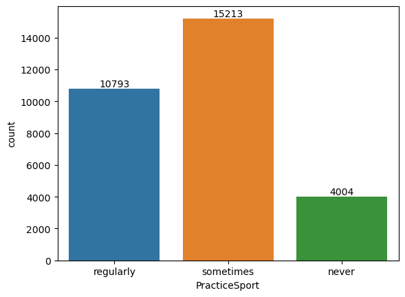

```python
import numpy as np
import pandas as pd
import matplotlib.pyplot as plt
import seaborn as sns
```


```python
df=pd.read_csv("Expanded_data.csv")
df
```


<div>
<style scoped>
    .dataframe tbody tr th:only-of-type {
        vertical-align: middle;
    }

    .dataframe tbody tr th {
        vertical-align: top;
    }

    .dataframe thead th {
        text-align: right;
    }
</style>
<table border="1" class="dataframe">
  <thead>
    <tr style="text-align: right;">
      <th></th>
      <th>Unnamed: 0</th>
      <th>Gender</th>
      <th>EthnicGroup</th>
      <th>ParentEduc</th>
      <th>LunchType</th>
      <th>TestPrep</th>
      <th>ParentMaritalStatus</th>
      <th>PracticeSport</th>
      <th>IsFirstChild</th>
      <th>NrSiblings</th>
      <th>TransportMeans</th>
      <th>WklyStudyHours</th>
      <th>MathScore</th>
      <th>ReadingScore</th>
      <th>WritingScore</th>
    </tr>
  </thead>
  <tbody>
    <tr>
      <th>0</th>
      <td>0</td>
      <td>female</td>
      <td>NaN</td>
      <td>bachelor's degree</td>
      <td>standard</td>
      <td>none</td>
      <td>married</td>
      <td>regularly</td>
      <td>yes</td>
      <td>3.0</td>
      <td>school_bus</td>
      <td>&lt; 5</td>
      <td>71</td>
      <td>71</td>
      <td>74</td>
    </tr>
    <tr>
      <th>1</th>
      <td>1</td>
      <td>female</td>
      <td>group C</td>
      <td>some college</td>
      <td>standard</td>
      <td>NaN</td>
      <td>married</td>
      <td>sometimes</td>
      <td>yes</td>
      <td>0.0</td>
      <td>NaN</td>
      <td>5 - 10</td>
      <td>69</td>
      <td>90</td>
      <td>88</td>
    </tr>
    <tr>
      <th>2</th>
      <td>2</td>
      <td>female</td>
      <td>group B</td>
      <td>master's degree</td>
      <td>standard</td>
      <td>none</td>
      <td>single</td>
      <td>sometimes</td>
      <td>yes</td>
      <td>4.0</td>
      <td>school_bus</td>
      <td>&lt; 5</td>
      <td>87</td>
      <td>93</td>
      <td>91</td>
    </tr>
    <tr>
      <th>3</th>
      <td>3</td>
      <td>male</td>
      <td>group A</td>
      <td>associate's degree</td>
      <td>free/reduced</td>
      <td>none</td>
      <td>married</td>
      <td>never</td>
      <td>no</td>
      <td>1.0</td>
      <td>NaN</td>
      <td>5 - 10</td>
      <td>45</td>
      <td>56</td>
      <td>42</td>
    </tr>
    <tr>
      <th>4</th>
      <td>4</td>
      <td>male</td>
      <td>group C</td>
      <td>some college</td>
      <td>standard</td>
      <td>none</td>
      <td>married</td>
      <td>sometimes</td>
      <td>yes</td>
      <td>0.0</td>
      <td>school_bus</td>
      <td>5 - 10</td>
      <td>76</td>
      <td>78</td>
      <td>75</td>
    </tr>
    <tr>
      <th>...</th>
      <td>...</td>
      <td>...</td>
      <td>...</td>
      <td>...</td>
      <td>...</td>
      <td>...</td>
      <td>...</td>
      <td>...</td>
      <td>...</td>
      <td>...</td>
      <td>...</td>
      <td>...</td>
      <td>...</td>
      <td>...</td>
      <td>...</td>
    </tr>
    <tr>
      <th>30636</th>
      <td>816</td>
      <td>female</td>
      <td>group D</td>
      <td>high school</td>
      <td>standard</td>
      <td>none</td>
      <td>single</td>
      <td>sometimes</td>
      <td>no</td>
      <td>2.0</td>
      <td>school_bus</td>
      <td>5 - 10</td>
      <td>59</td>
      <td>61</td>
      <td>65</td>
    </tr>
    <tr>
      <th>30637</th>
      <td>890</td>
      <td>male</td>
      <td>group E</td>
      <td>high school</td>
      <td>standard</td>
      <td>none</td>
      <td>single</td>
      <td>regularly</td>
      <td>no</td>
      <td>1.0</td>
      <td>private</td>
      <td>5 - 10</td>
      <td>58</td>
      <td>53</td>
      <td>51</td>
    </tr>
    <tr>
      <th>30638</th>
      <td>911</td>
      <td>female</td>
      <td>NaN</td>
      <td>high school</td>
      <td>free/reduced</td>
      <td>completed</td>
      <td>married</td>
      <td>sometimes</td>
      <td>no</td>
      <td>1.0</td>
      <td>private</td>
      <td>5 - 10</td>
      <td>61</td>
      <td>70</td>
      <td>67</td>
    </tr>
    <tr>
      <th>30639</th>
      <td>934</td>
      <td>female</td>
      <td>group D</td>
      <td>associate's degree</td>
      <td>standard</td>
      <td>completed</td>
      <td>married</td>
      <td>regularly</td>
      <td>no</td>
      <td>3.0</td>
      <td>school_bus</td>
      <td>5 - 10</td>
      <td>82</td>
      <td>90</td>
      <td>93</td>
    </tr>
    <tr>
      <th>30640</th>
      <td>960</td>
      <td>male</td>
      <td>group B</td>
      <td>some college</td>
      <td>standard</td>
      <td>none</td>
      <td>married</td>
      <td>never</td>
      <td>no</td>
      <td>1.0</td>
      <td>school_bus</td>
      <td>5 - 10</td>
      <td>64</td>
      <td>60</td>
      <td>58</td>
    </tr>
  </tbody>
</table>
<p>30641 rows × 15 columns</p>
</div>


```python
df=pd.read_csv("Expanded_data.csv")
print(df.head())
```

       Unnamed: 0  Gender EthnicGroup          ParentEduc     LunchType TestPrep  \
    0           0  female         NaN   bachelor's degree      standard     none   
    1           1  female     group C        some college      standard      NaN   
    2           2  female     group B     master's degree      standard     none   
    3           3    male     group A  associate's degree  free/reduced     none   
    4           4    male     group C        some college      standard     none   
    
      ParentMaritalStatus PracticeSport IsFirstChild  NrSiblings TransportMeans  \
    0             married     regularly          yes         3.0     school_bus   
    1             married     sometimes          yes         0.0            NaN   
    2              single     sometimes          yes         4.0     school_bus   
    3             married         never           no         1.0            NaN   
    4             married     sometimes          yes         0.0     school_bus   
    
      WklyStudyHours  MathScore  ReadingScore  WritingScore  
    0            < 5         71            71            74  
    1         5 - 10         69            90            88  
    2            < 5         87            93            91  
    3         5 - 10         45            56            42  
    4         5 - 10         76            78            75  
    


```python
df.describe()
```


<div>
<style scoped>
    .dataframe tbody tr th:only-of-type {
        vertical-align: middle;
    }

    .dataframe tbody tr th {
        vertical-align: top;
    }

    .dataframe thead th {
        text-align: right;
    }
</style>
<table border="1" class="dataframe">
  <thead>
    <tr style="text-align: right;">
      <th></th>
      <th>Unnamed: 0</th>
      <th>NrSiblings</th>
      <th>MathScore</th>
      <th>ReadingScore</th>
      <th>WritingScore</th>
    </tr>
  </thead>
  <tbody>
    <tr>
      <th>count</th>
      <td>30641.000000</td>
      <td>29069.000000</td>
      <td>30641.000000</td>
      <td>30641.000000</td>
      <td>30641.000000</td>
    </tr>
    <tr>
      <th>mean</th>
      <td>499.556607</td>
      <td>2.145894</td>
      <td>66.558402</td>
      <td>69.377533</td>
      <td>68.418622</td>
    </tr>
    <tr>
      <th>std</th>
      <td>288.747894</td>
      <td>1.458242</td>
      <td>15.361616</td>
      <td>14.758952</td>
      <td>15.443525</td>
    </tr>
    <tr>
      <th>min</th>
      <td>0.000000</td>
      <td>0.000000</td>
      <td>0.000000</td>
      <td>10.000000</td>
      <td>4.000000</td>
    </tr>
    <tr>
      <th>25%</th>
      <td>249.000000</td>
      <td>1.000000</td>
      <td>56.000000</td>
      <td>59.000000</td>
      <td>58.000000</td>
    </tr>
    <tr>
      <th>50%</th>
      <td>500.000000</td>
      <td>2.000000</td>
      <td>67.000000</td>
      <td>70.000000</td>
      <td>69.000000</td>
    </tr>
    <tr>
      <th>75%</th>
      <td>750.000000</td>
      <td>3.000000</td>
      <td>78.000000</td>
      <td>80.000000</td>
      <td>79.000000</td>
    </tr>
    <tr>
      <th>max</th>
      <td>999.000000</td>
      <td>7.000000</td>
      <td>100.000000</td>
      <td>100.000000</td>
      <td>100.000000</td>
    </tr>
  </tbody>
</table>
</div>


```python
df.info()
```

    <class 'pandas.core.frame.DataFrame'>
    RangeIndex: 30641 entries, 0 to 30640
    Data columns (total 15 columns):
     #   Column               Non-Null Count  Dtype  
    ---  ------               --------------  -----  
     0   Unnamed: 0           30641 non-null  int64  
     1   Gender               30641 non-null  object 
     2   EthnicGroup          28801 non-null  object 
     3   ParentEduc           28796 non-null  object 
     4   LunchType            30641 non-null  object 
     5   TestPrep             28811 non-null  object 
     6   ParentMaritalStatus  29451 non-null  object 
     7   PracticeSport        30010 non-null  object 
     8   IsFirstChild         29737 non-null  object 
     9   NrSiblings           29069 non-null  float64
     10  TransportMeans       27507 non-null  object 
     11  WklyStudyHours       29686 non-null  object 
     12  MathScore            30641 non-null  int64  
     13  ReadingScore         30641 non-null  int64  
     14  WritingScore         30641 non-null  int64  
    dtypes: float64(1), int64(4), object(10)
    memory usage: 3.5+ MB
    


```python
df.isnull().sum()
```


    Unnamed: 0                0
    Gender                    0
    EthnicGroup            1840
    ParentEduc             1845
    LunchType                 0
    TestPrep               1830
    ParentMaritalStatus    1190
    PracticeSport           631
    IsFirstChild            904
    NrSiblings             1572
    TransportMeans         3134
    WklyStudyHours          955
    MathScore                 0
    ReadingScore              0
    WritingScore              0
    dtype: int64


# Drop unnamed column


```python
df=df.drop("Unnamed: 0",axis=1)
print(df.head())
```

       Gender EthnicGroup          ParentEduc     LunchType TestPrep  \
    0  female         NaN   bachelor's degree      standard     none   
    1  female     group C        some college      standard      NaN   
    2  female     group B     master's degree      standard     none   
    3    male     group A  associate's degree  free/reduced     none   
    4    male     group C        some college      standard     none   
    
      ParentMaritalStatus PracticeSport IsFirstChild  NrSiblings TransportMeans  \
    0             married     regularly          yes         3.0     school_bus   
    1             married     sometimes          yes         0.0            NaN   
    2              single     sometimes          yes         4.0     school_bus   
    3             married         never           no         1.0            NaN   
    4             married     sometimes          yes         0.0     school_bus   
    
      WklyStudyHours  MathScore  ReadingScore  WritingScore  
    0            < 5         71            71            74  
    1         5 - 10         69            90            88  
    2            < 5         87            93            91  
    3         5 - 10         45            56            42  
    4         5 - 10         76            78            75  
    


```python
df.isnull().sum()

```


    Gender                    0
    EthnicGroup            1840
    ParentEduc             1845
    LunchType                 0
    TestPrep               1830
    ParentMaritalStatus    1190
    PracticeSport           631
    IsFirstChild            904
    NrSiblings             1572
    TransportMeans         3134
    WklyStudyHours          955
    MathScore                 0
    ReadingScore              0
    WritingScore              0
    dtype: int64


```python
print(df.head())
```

       Gender EthnicGroup          ParentEduc     LunchType TestPrep  \
    0  female         NaN   bachelor's degree      standard     none   
    1  female     group C        some college      standard      NaN   
    2  female     group B     master's degree      standard     none   
    3    male     group A  associate's degree  free/reduced     none   
    4    male     group C        some college      standard     none   
    
      ParentMaritalStatus PracticeSport IsFirstChild  NrSiblings TransportMeans  \
    0             married     regularly          yes         3.0     school_bus   
    1             married     sometimes          yes         0.0            NaN   
    2              single     sometimes          yes         4.0     school_bus   
    3             married         never           no         1.0            NaN   
    4             married     sometimes          yes         0.0     school_bus   
    
      WklyStudyHours  MathScore  ReadingScore  WritingScore  
    0            < 5         71            71            74  
    1         5 - 10         69            90            88  
    2            < 5         87            93            91  
    3         5 - 10         45            56            42  
    4         5 - 10         76            78            75  
    

# gender distribution


```python
plt.figure(figsize=(5,5))
ax=sns.countplot(data=df,x="Gender")
ax.bar_label(ax.containers[0])
plt.title("Gender Distribution")
plt.show
```


    <function matplotlib.pyplot.show(close=None, block=None)>


    

    

# from the above chart we have analysed that:the number of females in the data is more than the number of males

```python
gb=df.groupby("ParentEduc").agg({"MathScore":"mean","ReadingScore":"mean","WritingScore":"mean"})
print(gb)
```

                        MathScore  ReadingScore  WritingScore
    ParentEduc                                               
    associate's degree  68.365586     71.124324     70.299099
    bachelor's degree   70.466627     73.062020     73.331069
    high school         64.435731     67.213997     65.421136
    master's degree     72.336134     75.832921     76.356896
    some college        66.390472     69.179708     68.501432
    some high school    62.584013     65.510785     63.632409
    


```python
plt.figure(figsize=(4,4))
sns.heatmap(gb,annot=True)
plt.title("Relationship between Parent's Education and student's Score")
plt.show()
```


    

    

#from the above chart we have conclude that the education of the parents have good impact on their scores

```python
gb1=df.groupby("ParentMaritalStatus").agg({"MathScore":"mean","ReadingScore":"mean","WritingScore":"mean"})
print(gb)
```

                        MathScore  ReadingScore  WritingScore
    ParentEduc                                               
    associate's degree  68.365586     71.124324     70.299099
    bachelor's degree   70.466627     73.062020     73.331069
    high school         64.435731     67.213997     65.421136
    master's degree     72.336134     75.832921     76.356896
    some college        66.390472     69.179708     68.501432
    some high school    62.584013     65.510785     63.632409
    


```python
plt.figure(figsize=(4,4))
sns.heatmap(gb1,annot=True)
plt.title("Relationship between Parent's Marital Status and student's Score")
plt.show()
```


    

    

#from the above chart we have concluded that there is no/negligible impact on the
#student's score due to their parent's marital status

```python
sns.boxplot(data=df,x="MathScore")
plt.show()
```


    

    


```python
sns.boxplot(data=df,x="ReadingScore")
plt.show()
```


    

    


```python
sns.boxplot(data=df,x="WritingScore")
plt.show()
```


    

    


```python
print(df["EthnicGroup"].unique())
```

    [nan 'group C' 'group B' 'group A' 'group D' 'group E']
    

# Distribution of Ethnic Groups


```python
groupA=df.loc[(df["EthnicGroup"]=="group A")].count()
groupB=df.loc[(df["EthnicGroup"]=="group B")].count()
groupC=df.loc[(df["EthnicGroup"]=="group C")].count()
groupD=df.loc[(df["EthnicGroup"]=="group D")].count()
groupE=df.loc[(df["EthnicGroup"]=="group E")].count()

l=["group A","group B","group C","group D","group E"]
mylist = [groupA["EthnicGroup"],groupB["EthnicGroup"],groupC["EthnicGroup"],groupD["EthnicGroup"],groupE["EthnicGroup"]]

print(mylist)
plt.pie(mylist, labels=l, autopct = "%1.2f%%" )
plt.title("Distribution of Ethnic Groups")
plt.show()
```

    [2219, 5826, 9212, 7503, 4041]
    


    

    


```python
ax = sns.countplot(data = df,x = "EthnicGroup")
ax.bar_label(ax.containers[0])
```


    [Text(0, 0, '9212'),
     Text(0, 0, '5826'),
     Text(0, 0, '2219'),
     Text(0, 0, '7503'),
     Text(0, 0, '4041')]


    

    


```python
groupA=df.loc[(df["EthnicGroup"]=="group A")].count()
groupB=df.loc[(df["EthnicGroup"]=="group B")].count()
groupC=df.loc[(df["EthnicGroup"]=="group C")].count()
groupD=df.loc[(df["EthnicGroup"]=="group D")].count()
groupE=df.loc[(df["EthnicGroup"]=="group E")].count()

l=["group A","group B","group C","group D","group E"]
mylist = [groupA["EthnicGroup"],groupB["EthnicGroup"],groupC["EthnicGroup"],groupD["EthnicGroup"],groupE["EthnicGroup"]]

print(mylist)
plt.pie(mylist, labels=l, autopct = "%1.2f%%" )
plt.title("Distribution of Ethnic Groups")
plt.show()
```

    [2219, 5826, 9212, 7503, 4041]
    


    

    


# Distribution of Practice Sport


```python
print(df["PracticeSport"].unique())
```

    ['regularly' 'sometimes' 'never' nan]
    


```python
gb2=df.groupby("PracticeSport").agg({"MathScore":"mean","ReadingScore":"mean","WritingScore":"mean"})
print(gb2)
```

                   MathScore  ReadingScore  WritingScore
    PracticeSport                                       
    never          64.171079     68.337662     66.522727
    regularly      67.839155     69.943019     69.604003
    sometimes      66.274831     69.241307     68.072438
    


```python
plt.figure(figsize=(4,4))
sns.heatmap(gb2,annot=True)
plt.title("Relationship between Practice Sport Status and student's Score")
plt.show()
```


    

    

# from the above chart we have concluded that student who is involve in any practice storts they are getting more scores in the exam.

```python
reg=df.loc[(df["PracticeSport"]=="regularly")].count()
sometimes=df.loc[(df["PracticeSport"]=="sometimes")].count()
never=df.loc[(df["PracticeSport"]=="never")].count()

print("Regular : ",reg["PracticeSport"])
print("Sometimes : ",sometimes["PracticeSport"])
print("Never : ",never["PracticeSport"])
```

    Regular :  10793
    Sometimes :  15213
    Never :  4004
    


```python
reg=df.loc[(df["PracticeSport"]=="regularly")].count()
sometimes=df.loc[(df["PracticeSport"]=="sometimes")].count()
never=df.loc[(df["PracticeSport"]=="never")].count()

p=["Regularly","Sometimes","never"]
ps=[reg["PracticeSport"],sometimes["PracticeSport"],never["PracticeSport"]]

print(ps)
plt.pie(ps,labels=p,autopct="%1.2f%%")
plt.title("Distribution of Practice Sports")
plt.show()
```

    [10793, 15213, 4004]
    


    

    


```python
ax = sns.countplot(data = df,x = "PracticeSport")
ax.bar_label(ax.containers[0])
```


    [Text(0, 0, '10793'), Text(0, 0, '15213'), Text(0, 0, '4004')]


    

    

#Students practicing sports sometimes are in greater numbers than regular and never